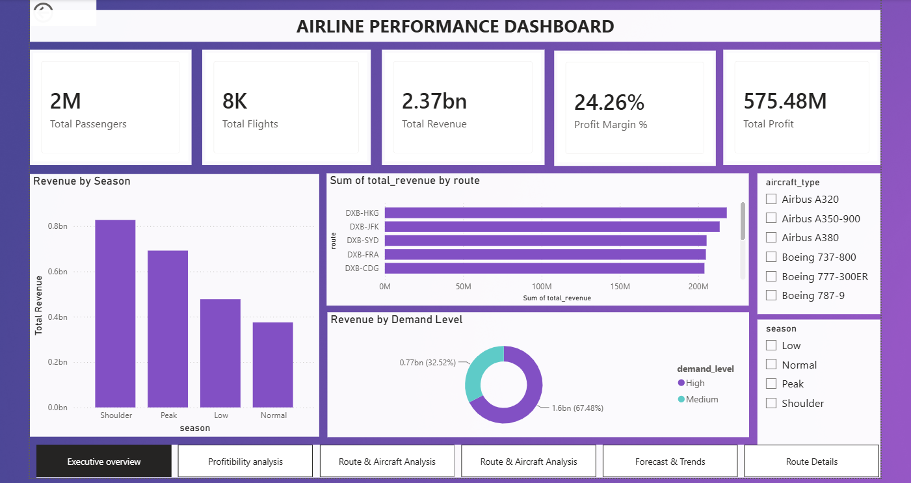
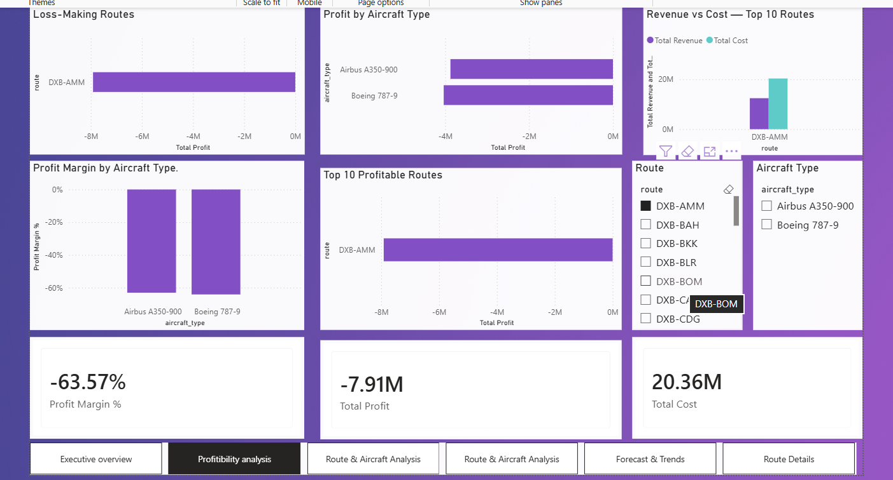
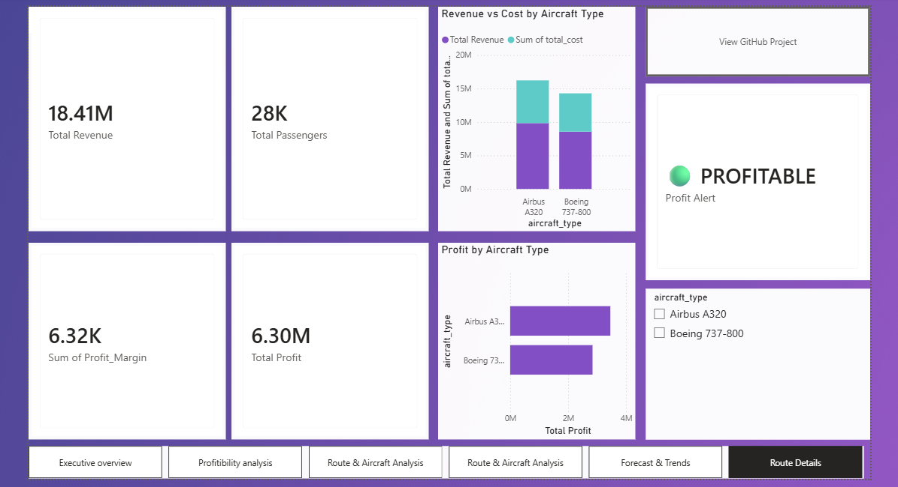
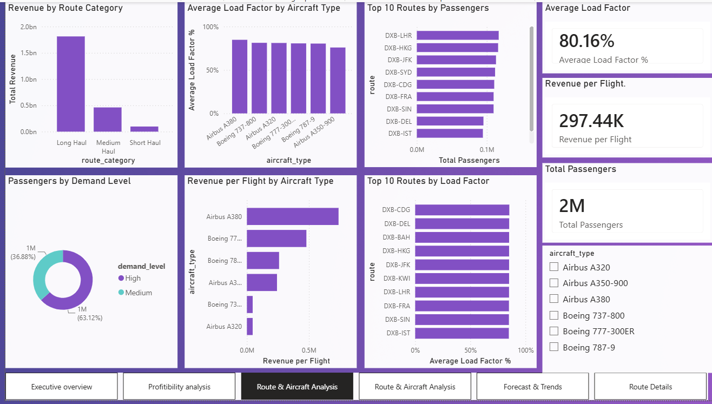
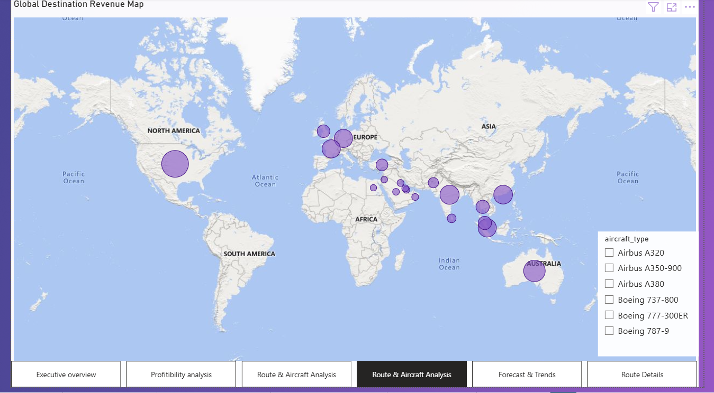
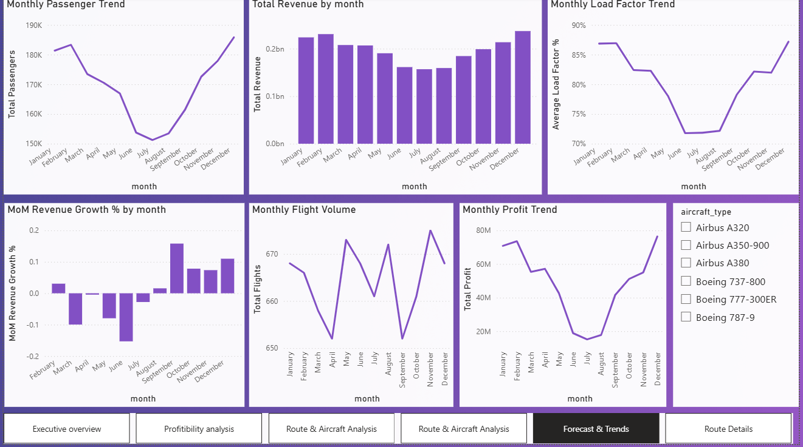

# ✈️ Airline Data Analytics (Flight Network & Profitability Analysis)

An end-to-end commercial aviation analytics project analyzing revenue, profitability, passenger volume, fleet economics, cost drivers, seasonality, and geographic network performance across **7,974 flight operations** originating from Dubai International Airport (DXB).

---

## 📊 Verified Baseline Benchmarks

- **Total Flights:** 7,974
- **Total Passengers:** 2,031,928
- **Total Revenue:** $2,371,756,240.42
- **Total Cost:** $1,796,275,579.39
- **Total Profit:** $575,480,660.99
- **Profit Margin:** 24.26%

---

## 📈 Power BI Dashboard

The project includes a Power BI dashboard for analyzing airline performance, profitability, routes, aircraft, geographic performance, and future trends.

### Executive Overview



### Profitability Analysis



### Route Details



### Route & Aircraft Analysis



### Map Analysis



### Forecast Trends



### Power BI File

The Power BI report is available in the repository:

`powerbi/airline_da.pbix`

The `.pbix` file can be downloaded and opened using **Power BI Desktop**.

---

## 🗂️ Project Structure

```text
AIRLINE_DATA_ANALYTICS/
│
├── dashboard/
│   ├── EXECUTIVE_OVERVIEW.png
│   ├── FORECAST_TRENDS.png
│   ├── MAP_ANALYSIS.png
│   ├── PROFITABILITY_ANALYSIS.png
│   ├── ROUTE_DETAILS.png
│   └── ROUTE&AIRCRAFT_ANALYSIS.png
│
├── data/
│   ├── lookup/
│   │   └── airport_lookup.csv
│   ├── processed/
│   │   └── airline_cleaned.csv
│   └── raw/
│       └── airline_route_profitability.csv
│
├── notebooks/
│   └── airline_eda.ipynb
│
├── powerbi/
│   ├── airline_da.pbix
│   └── power_query_script.m
│
├── scripts/
│   ├── data_cleaning.py
│   └── init_lookup.py
│
├── sql/
│   ├── business_analysis.sql
│   └── create_tables.sql
│
├── .gitignore
├── README.md
└── requirements.txt

🛠️ Technologies Used
Python – Data cleaning and preprocessing
Pandas – Data manipulation and analysis
Jupyter Notebook – Exploratory Data Analysis
SQL – Business analysis and querying
PostgreSQL – Data storage
Power BI – Interactive dashboard and visualization
Power Query – Data transformation
Git & GitHub – Version control
🔄 Data Analysis Workflow
Raw Airline Dataset
        ↓
Data Cleaning
        ↓
Processed Dataset
        ↓
Exploratory Data Analysis
        ↓
SQL Business Analysis
        ↓
Power Query Transformation
        ↓
Power BI Data Model
        ↓
Interactive Dashboard
        ↓
Business Insights
🎯 Key Business Questions

The analysis answers the following business questions:

Which routes generate the highest revenue?
Which routes are the most profitable?
Which aircraft types provide better profitability?
How does passenger volume change over time?
What are the major cost drivers?
Which destinations have the highest profit margins?
How does load factor affect revenue and profitability?
Which months show the strongest performance?
Which routes and aircraft combinations perform best?
What are the expected future revenue and profitability trends?
📌 Key Project Highlights
Analyzed 7,974 flight operations
Analyzed over 2 million passengers
Generated approximately $2.37B in total revenue
Calculated approximately $1.80B in total cost
Generated approximately $575.48M in total profit
Achieved an overall 24.26% profit margin
Performed route-level profitability analysis
Performed aircraft and fleet analysis
Analyzed passenger and load-factor trends
Created geographic/map-based analysis
Implemented forecast trend analysis
Built an interactive Power BI dashboard
Created multiple business-focused KPI visualizations
🚀 How to Run
Install Dependencies
pip install -r requirements.txt
Run Data Cleaning
python scripts/data_cleaning.py
Initialize Airport Lookup
python scripts/init_lookup.py
Exploratory Data Analysis

Open:

notebooks/airline_eda.ipynb

using Jupyter Notebook or VS Code.

SQL Analysis

The SQL business analysis scripts are available in:

sql/business_analysis.sql
Power BI Dashboard

Open:

powerbi/airline_da.pbix

using Power BI Desktop to explore the interactive dashboard.

📊 Dashboard Pages
Dashboard	Purpose
Executive Overview	Overall airline KPIs and performance
Profitability Analysis	Revenue, cost, profit and margin analysis
Route Details	Detailed route-level performance
Route & Aircraft Analysis	Comparison of routes and aircraft
Map Analysis	Geographic network performance
Forecast Trends	Future revenue and performance trends
💡 Business Insights

The dashboard helps identify:

High-performing and low-performing routes
Most profitable aircraft categories
Revenue and cost patterns
Passenger demand trends
Geographic opportunities
Seasonal performance variations
Future business trends

These insights can support route planning, fleet optimization, pricing decisions, and profitability improvement.

👩‍💻 Author

Jayasri Rajendiran

Data Analytics 